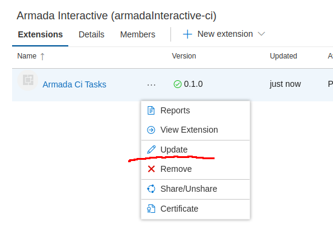
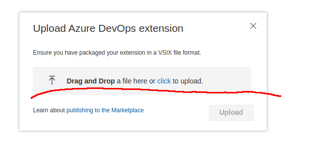

==========================================================
# Armada Interactive

Fork of the [Microsoft Azure Pipeline Tasks](https://github.com/microsoft/azure-pipelines-tasks)
repository.

Reason for forking is the upgrade to Unity 2019.3 requires changes to the parameters to `xcodebuild`
and there is currently no customizability point in the `XcodeV5` task we can use to accomplish that.
[There is an issue open on the Microsoft repo to support this](https://github.com/microsoft/azure-pipelines-tasks/issues/12263).

More information about the changes can be found [here](./Tasks/XcodeV5/xcode.ts).

Instead of copying the existing `XcodeV5` task we made (super small) changes to the existing task,
the hope is that this will make it easier to pull in changes from upstream.

We created a new GUID for the `XcodeV5` task: `43F2B7CB-BBEC-405A-894F-1BFA4C1DD46A` (so it wont
conflict with the default one). Also we've updated the name from `Xcode` to `ArmadaXcode` to make
it easier to distinguish.

## Building

You need Node `v8.17.0` to build this, weirdly enough you cannot build it with the latest node.
[There is an open issue about this](https://github.com/microsoft/azure-pipelines-tasks/issues/11136).
To make it easier to use an old Node, you can install the `n` version manager (`npm install -g n`) then
using `n` you can switch the node version: (`n v8.17.0`).

* Install the dependencies using npm (`npm install`).
* Build the `XcodeV5` task using node (`node make.js build --task XcodeV5`).

## Publishing

The `XcodeV5` task is wrapped in a `vss` extension that can be installed on Azure DevOps.
The manifest for the `armada-ci-tasks` extension can be found [here](./armada-ci-tasks-extension.json).

To package the `vss` extension you need the [`tfx` cli tooling](https://github.com/Microsoft/tfs-cli).
Which can be easily installed using npm (`npm install -g tfx-cli`).

Then to package it you can just run the following command:

* `tfx extension create --manifest-globs ./armada-ci-tasks-extension.json --rev-version`

This will create a `vsix` file called: `armadainteractive-ci.armada-ci-tasks-*.*.*.vsix`.

To upload the package you can either use the cli tooling or use the web ui at:
`https://marketplace.visualstudio.com/manage/publishers/armadainteractive-ci`.

End of Armada readme, below is the original Microsoft readme:

==========================================================

# Azure Pipelines Tasks

## Overview
This repo contains the tasks that are provided out-of-the-box with Azure Pipelines and Team Foundation Server.

This provides open examples on how we write tasks which will help you write other tasks which can be uploaded to your account or server.  See **Writing Tasks** below.

## Status
|   | Build & Test |
|---|:-----:|
| **Windows**|[![Build & Test][win-build-badge]][win-build]| 
| **macOS**|[![Build & Test][macOS-build-badge]][macOS-build]| 
| **Linux**|[![Build & Test][linux-build-badge]][linux-build]|

[win-build-badge]: https://dev.azure.com/mseng/PipelineTools/_apis/build/status/azure-pipelines-tasks.ci-windows
[win-build]: https://dev.azure.com/mseng/PipelineTools/_build/latest?definitionId=7634

[macOS-build-badge]: https://dev.azure.com/mseng/PipelineTools/_apis/build/status/azure-pipelines-tasks.ci-macos
[macOS-build]: https://dev.azure.com/mseng/PipelineTools/_build/latest?definitionId=7635

[linux-build-badge]: https://dev.azure.com/mseng/PipelineTools/_apis/build/status/azure-pipelines-tasks.ci-linux
[linux-build]: https://dev.azure.com/mseng/PipelineTools/_build/latest?definitionId=7636

## How to Use Tasks

See the documentation for [Continuous integration and deployment](https://aka.ms/tfbuild).

## Writing Tasks

If you need custom functionality in your build/release, it is usually simpler to use the existing script running tasks such as the PowerShell or Bash tasks.  Writing a new task may be appropriate if you need deeper integration or reusability in many build definitions

Tasks are simply tool runners.  They know how to run MSBuild, VSTest, etc... in a first class way and handle return codes, how to treat std/err out, and how to write timeline records based on expected output.  They also get access to credentials to write back to TFS/Azure Pipelines. 

For uploading custom tasks to Azure Pipelines use the [TFS Cross Platform Command Line utility](https://github.com/Microsoft/tfs-cli).

Tasks can also be deployed with an Azure DevOps extension. See [this tutorial](https://docs.microsoft.com/en-us/vsts/extend/develop/add-build-task) for how to write a custom task and package it inside an extension.

## Contributing

This project welcomes [contributions and suggestions](docs/contribute.md).

This project has adopted the [Microsoft Open Source Code of Conduct](https://opensource.microsoft.com/codeofconduct/).
For more information see the [Code of Conduct FAQ](https://opensource.microsoft.com/codeofconduct/faq/) or
contact [opencode@microsoft.com](mailto:opencode@microsoft.com) with any additional questions or comments.

## Issues

We accept issue reports both here (file a GitHub issue) and in [Developer Community](https://developercommunity.visualstudio.com/spaces/21/index.html).

Do you think there might be a security issue? Have you been phished or identified a security vulnerability? Please don't report it here - let us know by sending an email to secure@microsoft.com.
